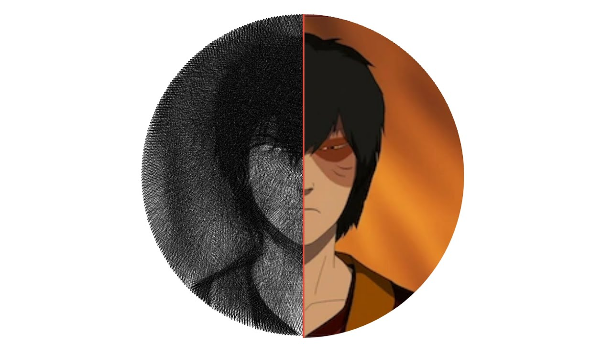

# [String Art !](https://www.youtube.com/watch?v=ZspIYyTzPG0)

## Auteur

- [Alexandre Jeunot-Caire](https://github.com/jeunotca)
- [Robin Augereau](https://github.com/newtondotcom)


## Visuel



## Description

Programme <b>personnel</b> artistique développé en `Python` permettant de créer des oeuvres basées sur le `string art`, c'est-à-dire l'entrelacement de fils faisant ressortir une image.

Dans la version que j'ai créée, il est [en théorie possible]("https://www.dailymotion.com/video/x4mv8h1") de n'utiliser qu'une seule ficelle que l'on déroule en suivant l'ordre donné par mon algorithme.

### Implémentation

Le programme a été développé en `Python` en utilisant principalement les bibliothèques `opencv` (cv2) et `numpy`.

## Installation

### Récupération des sources

* Depuis l'invité de commandes (HTTP):
```bash
$ git clone https://github.com/jeunotca/string-art.git
$ cd string-art
```

**OU**

* Depuis l'invité de commandes (SSH):
```bash
$ git clone git@github.com:jeunotca/string-art.git
$ cd string-art
```

**OU**
* En téléchargeant les sources puis en extrayant l'archive

### Installation

```bash
$ pip install -r requirements.txt
```

**OU**

* En téléchargeant les sources puis en extrayant l'archive

## Utilisation

### Exécution du projet

```bash
$ python3 main.py
```

### Paramètres

Dans  `main.py`, vous trouverez les paramètres suivants :

```python
IMG = "./images/zuko3.png"
DECOMPOSITION = False
NUMBER_LINES = 10000
NUMBER_POINTS = 360
```

* `IMG` correspond à l'adresse relative de l'image à utiliser. Dans cet exemple, il s'agit de l'image `zuko3.png` situé dans le dossier `images`.
* `DECOMPOSITION` est un paramètre permettant la [réalisation de vidéos](https://www.youtube.com/watch?v=ZspIYyTzPG0). Le passer à `True` provoquera la création d'une image par nouveau lien tissé, permettant ensuite de les assembler dans un outil de montage vidéo.
* `NUMBER_LINES` représente le nombre de liens à tisser. Plus il y en a, plus l'image sera détaillée et proche de la réalité, au prix d'un temps d'exécution accru.
* `NUMBER_POINTS` représente le nombre de points constituants le cercle externe. Plus il y en a, plus l'image sera détaillée grâce à des liens qui suivront plus fidèlement les courbes de l'image d'origine.