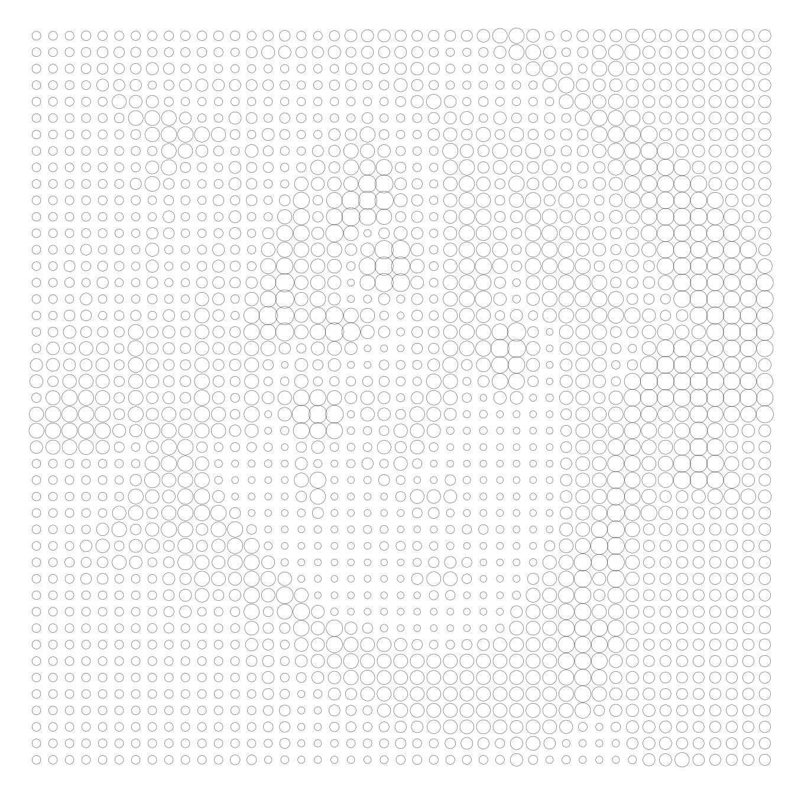

# String Art & Dot Painting

## Authors

- [Alexandre Jeunot-Caire](https://github.com/jeunotca)
- [Robin Augereau](https://github.com/newtondotcom)

## Visuals
### String Art
<picture>

</picture>
<picture>

</picture>

### Dot Painting
<picture>

</picture>
<picture>

</picture>
<picture>

</picture>


## Description

- The "String Art" project is a forked version of an existing project.
- The "Dot Painting" project was coded by me.

## Installation

### Retrieving the sources

* From the command line (HTTP):
```bash
$ git clone https://github.com/newtondotcom/string-art
$ cd string-art
```

### Installation

I would recommand using [uv](https://github.com/astral-sh/uv) so
```bash
$ uv sync
```

## Using the String Art

### Running the project

```bash
$ uv run stringart.py
```

### Parameters

In `stringart.py`, you will find the following parameters:

```python
IMG = "./images/zuko3.png"
DECOMPOSITION = False
NUMBER_LINES = 10000
NUMBER_POINTS = 360
```

* `IMG` refers to the relative path of the image to use. In this example, it is the `zuko3.png` image located in the `images` folder.
* `DECOMPOSITION` is a parameter for creating [videos](https://www.youtube.com/watch?v=ZspIYyTzPG0). Setting it to `True` will create an image for each new woven line, which can then be assembled into a video using a video editing tool.
* `NUMBER_LINES` represents the number of lines to weave. The more lines, the more detailed and closer to reality the image will be, at the cost of increased execution time.
* `NUMBER_POINTS` represents the number of points on the outer circle. The more points there are, the more detailed the image will be, as the lines will follow the curves of the original image more closely.

## Using the Dot Painting

### Running the project

```bash
$ uv run paint.py
```

### Parameters

In `paint.py`, you will find the following parameters:

```python
REGION_SIZE = 5
IMAGE_PATH = 'images/meliodas3.jpg'
OUTPUT = 'JPG'  # 'PDF' or 'JPG'
MAX_DOT_SIZE = REGION_SIZE * 12 # this value changes depending on the region size and the image format
```

* `IMAGE_PATH` refers to the relative path of the image to use. In this example, it is the `zuko3.png` image located in the `images` folder.
* `REGION_SIZE` is the size of the regions that will be used to calculate the average color. The smaller the region size, the more detailed the image will be, but the more dots will be needed to represent it. The larger the region size, the less detailed the image will be, but the fewer dots will be needed to represent it.
* `OUTPUT` specifies the format in which the image will be saved, either `'JPG'` or `'PDF'`.
* `MAX_DOT_SIZE` is the maximum size of the dots that will be used. This value changes depending on the region size and the image format, as the dots will need to vary in size to best represent the image.
